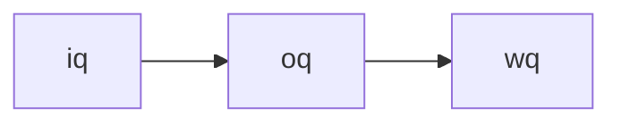
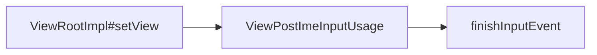

## Android 卡顿问题

### 一、Android Input 模型


InputReader 和 InputDispatcher 是跑在 system_server 进程中的两个 Native 循环线程，负责读取和分发 input 事件。

EventHub 利用 inotify 和 epoll 机制监听 /dev/input 目录下的 input 设备驱动节点，通过 EventHub 的`getEvents`接口就可以监听并获取到 Input 事件。

InputDispatcher 被唤醒后会先将事件放在 InboundQueue 队列（即 Systrace 上看到的 iq 队列）中，然后找到具体处理此 Input 事件的应用目标窗口，并将 Input 事件放入对应的应用目标窗口 OutboundQueue 队列（也就是 Systrace 上看到的 oq 队列）中，等待进一步通过 SocketPair 双工信道发送 Input 事件到应用目标窗口中。

最后当事件发送到具体的应用目标窗口后，会将事件移动到 WaitQueue 队列中（也就是 Systrace 上看到的 wq 队列）并一直等待收到目标应用处理 Input 事件完成后的反馈后再从队列中移除，**如果 5 秒内没有收到目标应用窗口处理完成此次 Input 事件的反馈，就会报该应用**。



当 Input 触控事件通过 socket 传递到应用进程这边之后，会唤醒应用的 UI 线程在`ViewRootImpl#deliverInputEvent`的流程中进行 Input 事件的具体分发与处理：



1. 创建的多个不同类型 InputUsage 中依次处理（比如对输入法处理逻辑的封装 ImeInputUsage，某些 key 类型的 Input 事件会由它先交给输入法进程处理完后再交给应用窗口的 InputUsage 处理），整个处理流程是按照责任链的设计模式进行
2. 从 View 布局树根节点开始遍历 View 树进行事件的分发、拦截、处理的逻辑
3. 通过 JNI 调用到 native 层 InputConsumer 的`sendFinishedSignal`函数中通过 socket 消息通知系统框架中的 InputDispatcher 该Input 事件处理完成，触发从 wq 队列中及时移除待处理事件以免报 ANR 异常。
4. 一次滑动过程的触控交互的 InputResponse 区域中一般会包含一个 Input 的 ACTION_DOWN 事件 + 多个 ACTION_MOVE 事件 + 一个 ACTION_UP 事件，会经判断之后会调用`View#invalidata`等相关接口触发 UI 线程的绘制上更新画面的操作。

### 二、应用 UI 线程消息循环机制

App 应用启动时，在 Fork 创建进程后会通过反射创建代表应用主线程的 ActivityThread 对象并执行其`main`函数，进行 UI 主线程的初始化工作，创建 Looper、MessageQueue 并启动 loop 消息循环，开始准备接收消息。主线程初始化完成后，主线程就进入阻塞状态（进入 epoll_wait 状态，并释放 CPU 运行资源），等待 Message，一旦有 Message 发过来，主线程就会被唤醒，处理 Message，处理完成之后，如果没有其他的 Message 需要处理，那么主线程就会进入休眠阻塞状态继续等待。**可以说 Android 系统的运行是受消息机制驱动的**。


### 三、 Android 屏幕刷新机制

#### 3.1 双缓存 + Vsync

在一个典型的显示系统中，一般包括 CPU、GPU、Display 三个部分：**CPU 负责计算帧数据，把计算好的数据交给 GPU，GPU 会对图形数据进行渲染，渲染好后放到 buffer （图像缓冲区）里存起来，然后 Display （屏幕或显示器）负责把 Buffer 里的数据呈现到屏幕上**。

 

屏幕上显示的内容需要不断更新，若在同一个 Buffer 进行读取和写入操作，将会导致屏幕显示多帧内容而出现显示错乱。所以硬件层除了提供了一个 Buffer 用于屏幕显示，还会提供一个 Buffer 用于后台的 CPU/GPU 图形绘制与合成，也就是**双缓冲**：让绘制和显示器拥有各自的 Buffer: CPU/GPU 始终将完成的一帧图像数据写入到后缓存区（Back Buffer），而显示器使用前缓存区（Front Buffer），当屏幕刷新时，Front Buffer 并不会发生变化，当 Back Buffer 准备就绪后，它们才进行交换。


“当前一帧显示完成，后一帧准备好了”：


1. 屏幕刷新率比系统帧率快：卡顿
2. 系统帧率比屏幕刷新率快：屏幕撕裂

解决办法：**让屏幕控制前后缓冲区的切换时机，让系统帧速率配合屏幕刷新率的节奏。**——垂直同步（VSync）。**屏幕的显示节奏是由屏幕刷新率的硬件参数决定且固定的，软件操作系统需要配合屏幕的显示，在固定的时间内准备好下一帧，以供屏幕进行显示，两者通过 Vsync 信号来实现同步。**

> VSync：当屏幕从缓冲区扫描完一帧到屏幕上之后，开始扫描下一帧之前，中间会有一个时间间隙，称为`Vetrical Blanking Interval (VBI)`，这个时间点其实就是进行前后缓存区交换的最佳时机，此时屏幕并没有在刷新，也就避免了屏幕撕裂现象的产生，所以在此时发出的一个同步 Vsync 信号，该信号用来切换前缓冲区和后缓冲区（本质就是内存地址的交换，瞬间即可完成），即可达最佳效果。


**上层 CPU 和 GPU 并不知道 Vsync 信号的到来，所以在底层屏幕的 Vsync 信号发出后并没有及时收到并开始下一帧画面的操作处理。**

为了优化系统显示性能，Google 在 Android 4.1 系统中对 Android Display 系统进行了重构，引入了 Project Butter（黄油计划）：**在系统收到 Vsync 信号后，上层 CPU 和 GPU 马上进行下一帧画面数据的处理，完成后及时将数据写入到 Buffer 中，Google 称之为 Drawing with Vsync**。


#### 3.2 Choreographer`/ ˌkɔːriˈɑːɡrəfər /`（中译“编舞者”）

1. 承上：负责接收和处理 App 的改革中更新消息和回调，等到 Vsync 到来的时候统一处理。比如集中处理 Input（主要是 Input 事件的处理）、Animation、Traversal（包括`measure、layout、draw`），判断卡顿掉帧情况，记录 Callback 耗时等；
2. 启下：负责请求和接收 Vsync 信号。接收 Vsync 信号到来的事件后回调（通过`FrameDisplayEventReceiver.onVsync`），并请求 Vsync（`FrameDisplayEventReceiver.scheduleVsync`）。

**一般应用 App 有界面 UI 的变化时，最终都会调用走到`ViewRootImpl#scheduleTravesals()`**，该方法中会往 Choreographer 中放入 CALLBACK_TRAVERSAL 类型的绘制任务。

```java
/*frameworks/base/core/java/android/view/ViewRootImpl.java*/
@UnsupportedAppUsage
void scheduleTraversals() {
    if (!mTraversalScheduled) {
         ...
         // 通过Choreographer往主线程消息队列添加CALLBACK_TRAVERSAL绘制类型的待执行消息，用于触发后续UI线程真正实现绘制动作
         mChoreographer.postCallback(
                    Choreographer.CALLBACK_TRAVERSAL, mTraversalRunnable, null);
         ...
     }
}
```


### 四、UI 线程绘制流程


### 五、RenderThread 线程渲染流程

在`ViewRootImpl`中完成了对界面的`measure`、`layout`和`draw`等绘制流程后，用户依然还是看不到屏幕上显示的应用界面内容，因为整个`Android`系统的显示流程除了前面讲到的 UI 线程的绘制外，界面还需要经过`RenderThread`线程的渲染处理，渲染完成后，还需要通过`Binder`调用“上帧”交给`surfaceflinger`进程中进行合成后送显才能最终显示到屏幕上。

```java
/*frameworks/base/core/java/android/view/ViewRootImpl.java*/
private boolean draw(boolean fullRedrawNeeded) {
    ...
    if (mAttachInfo.mThreadedRenderer != null && mAttachInfo.mThreadedRenderer.isEnabled()) {
        ...
        // 硬件加速条件下的界面渲染流程
        mAttachInfo.mThreadedRenderer.draw(mView, mAttachInfo, this);
    } else {
        ...
    }
}

/*frameworks/base/core/java/android/view/ThreadedRenderer.java*/
void draw(View view, AttachInfo attachInfo, DrawCallbacks callbacks) {
    ...
    // 1.从DecorView根节点出发，递归遍历View控件树，记录每个View节点的绘制操作命令，完成绘制操作命令树的构建
    updateRootDisplayList(view, callbacks);
    ...
    // 2.JNI调用同步Java层构建的绘制命令树到Native层的RenderThread渲染线程，并唤醒渲染线程利用OpenGL执行渲染任务；
    int syncResult = syncAndDrawFrame(choreographer.mFrameInfo);
    ...
}
```

#### 5.1 构建绘制命令树

**构建绘制命令树的过程是从`View`控件树的根节点`DecorView`触发，递归调用每个子`View`节点的`updateDisplayListIfDirty`函数，最终完成绘制树的创建，简述流程如下**：

1. 利用`View`对象构造时创建的`RenderNode`获取一个`SkiaRecordingCanvas`“画布”；
2. 利用`SkiaRecordingCanvas`，**在每个子`View`控件的`onDraw`绘制函数中调用`drawLine`、`drawRect`等绘制操作时，创建对应的`DisplayListOp`绘制命令，并缓存记录到其内部的`SkiaDisplayList`持有的`DisplayListData`中**；
3. 将包含有`DisplayListOp`绘制命令缓存的`SkiaDisplayList`对象设置填充到`RenderNode`中；
4. 最后将根`View`的缓存`DisplayListOp`设置到`RootRenderNode`中，完成构建。


#### 5.2 执行渲染绘制任务

应用在`UI`线程中从根节点`DecorView`出发，递归遍历每个子`View`节点，搜集其`drawXXX`绘制动作并转换成`DisplayListOp`命令，将其记录到`DisplayListData`并填充到`RenderNode`中，最终完成整个`View`绘制命令树的构建。从此UI线程的绘制任务就完成了。下一步`UI`线程将唤醒`RenderThread`渲染线程，触发其利用`OpenGL`执行界面的渲染任务。

`UI`线程利用`RenderProxy`向`RenderThread`线程发送一个`DrawFrameTask`任务请求，**`RenderThread`被唤醒，开始渲染，大致流程如下**：

1. `syncFrameState`中遍历`View`树上每一个`RenderNode`，执行`prepareTreeImpl`函数，实现同步绘制命令树的操作；

2. 调用`OpenGL`库`API`使用`GPU`硬件，按照构建好的绘制命令完成界面的渲染（具体过程，由于本文篇幅所限，暂不展开分析）；

3. 将前面已经绘制渲染好的图形缓冲区`Binder`上帧给`SurfaceFlinger`合成和显示；


### 六、 SurfaceFlinger 图形合成

`SurfaceFlinger`合成显示部分属于`Android`系统`GUI`中图形显示的内容，简单的说`SurfaceFlinger`作为系统中独立运行的一个`Native`进程，**借用`Android`官网的描述，其职责就是负责接受来自多个来源的数据缓冲区，对它们进行合成，然后发送到显示设备。


承上启下的作用：

- **对上**：通过`Surface`与不同的应用进程建立联系，接收它们写入`Surface`中的绘制缓冲数据，对它们进行统一合成。
- **对下**：通过屏幕的后缓存区与屏幕建立联系，发送合成好的数据到屏幕显示设备。

图形的传递是通过`Buffer`作为载体，`Surface`是对`Buffer`的进一步封装，也就是说`Surface`内部具有多个`Buffer`供上层使用，如何管理这些`Buffer`呢？答案就是`BufferQueue` 。

#### 6.1 BufferQueue 机制


`BufferQueue`是一个**典型的生产者-消费者模型中的数据结构**。在`Android`应用的渲染流程中，应用扮演的就是“生产者”的角色，而`SurfaceFlinger`扮演的则是“消费者”的角色，**其配合工作的流程如下**：

1. 应用进程中在开始界面的绘制渲染之前，需要通过`Binder`调用`dequeueBuffer`接口从`SurfaceFlinger`进程中管理的`BufferQueue` 中申请一张处于`free`状态的可用`Buffer`，如果此时没有可用`Buffer`则阻塞等待；

2. 应用进程中拿到这张可用的`Buffer`之后，选择使用`CPU`软件绘制渲染或`GPU`硬件加速绘制渲染，渲染完成后再通过`Binder`调用`queueBuffer`接口将缓存数据返回给应用进程对应的`BufferQueue`（如果是 `GPU` 渲染的话，这里还有个 `GPU`处理的过程，所以这个 `Buffer` 不会马上可用，需要等 `GPU` 渲染完成的`Fence`信号），并申请`sf`类型的`Vsync`以便唤醒“消费者”`SurfaceFlinger`进行消费；

3. `SurfaceFlinger` 在收到 `Vsync` 信号之后，开始准备合成，使用 `acquireBuffer`获取应用对应的 `BufferQueue` 中的 `Buffer` 并进行合成操作；

4. 合成结束后，`SurfaceFlinger` 将通过调用 `releaseBuffer`将 `Buffer` 置为可用的`free`状态，返回到应用对应的 `BufferQueue`中。

#### 6.2 Vsync 同步机制

`Android`系统中的`Vsync`信号的产生与管理都是由`SurfaceFlinger`模块统一负责的，`Vysnc`信号一般分为两种类型：

1. `app`类型的`Vsync`：**`app`类型的`Vysnc`信号由上层应用中的`Choreographer`根据绘制需求进行注册和接收，用于控制应用UI绘制上帧的生产节奏**。根据`3.4`小结中的分析：应用在UI线程中调用`invalidate`刷新界面绘制时，需要先透过`Choreographer`向系统申请注册`app`类型的`Vsync`信号，待`Vsync`信号到来后，才能往主线程的消息队列放入待绘制任务进行真正`UI`的绘制动作；

2. `sf`类型的`Vsync`:**`sf`类型的`Vsync`是用于控制`SurfaceFlinger`的合成消费节奏**。应用完成界面的绘制渲染后，通过`Binder`调用`queueBuffer`接口将缓存数据返还给应用对应的`BufferQueue`时，会申请`sf`类型的`Vsync`，待`SurfaceFlinger` 在其 UI 线程中收到 `Vsync` 信号之后，便开始进行界面的合成操作。

**`Vsync`信号的生成是参考屏幕硬件的刷新周期的**，其架构如下图所示：


#### 6.3 帧数据的提交消费过程

应用进程的`RenderThread`渲染线程在执行完一帧画面的渲染操作的最后，会通过`Binder`调用`queueBuffer`接口将一帧数据提交给`SurfaceFlinger`进程进行消费合成显示。

```c++
/*frameworks/native/libs/gui/BufferQueueProducer.cpp*/
status_t BufferQueueProducer::queueBuffer(int slot,
        const QueueBufferInput &input, QueueBufferOutput *output) {
    ATRACE_CALL();
    ......
     if (frameAvailableListener != nullptr) {
        frameAvailableListener->onFrameAvailable(item);
     }
    ......
}
```

```c++
/*frameworks/native/services/surfaceflinger/BufferQueueLayer.cpp*/
void BufferQueueLayer::onFrameAvailable(const BufferItem& item) {
    ......
     mFlinger->signalLayerUpdate();//这里触发申请一下个Vsync-sf信号
    ......
}

/*frameworks/native/services/surfaceflinger/SurfaceFlinger.cpp*/
void SurfaceFlinger::signalLayerUpdate() {
    ......
    mEventQueue->invalidate();
    ......
}

/*frameworks/native/services/surfaceflinger/Scheduler/MessageQueue.cpp*/
void MessageQueue::invalidate() {
    ......
    mEvents->requestNextVsync();// 申请一下个Vsync-sf信号
    ......
}
```


由上面分析可知，只要有`layer`上帧，那么就会申请下一次的`Vsync-sf`信号， 当`Vsync-sf`信号来时会调用`onMessageReceived`函数来处理帧数据：

```c++
/*frameworks/native/services/surfaceflinger/SurfaceFlinger.cpp*/
void SurfaceFlinger::onMessageInvalidate(nsecs_t expectedVSyncTime) {
    ATRACE_CALL();
    ......
    refreshNeeded |= handleMessageInvalidate();
    ......
    signalRefresh();//再次向消息队列发送一个消息，消息到达时会调用onMessageRefresh
    ......
}

bool SurfaceFlinger::handleMessageInvalidate() {
    ATRACE_CALL();
    bool refreshNeeded = handlePageFlip();
    ......
}
```

```c++
/*frameworks/native/services/surfaceflinger/SurfaceFlinger.cpp*/
bool SurfaceFlinger::handlePageFlip()
{
    ATRACE_CALL();
    ......
    mDrawingState.traverse([&](Layer* layer) {
        if (layer->hasReadyFrame()) {
            frameQueued = true;
            if (layer->shouldPresentNow(expectedPresentTime)) {
                mLayersWithQueuedFrames.push_back(layer);
            } 
            .......
        } 
        ......
    });
    ......
    for (auto& layer : mLayersWithQueuedFrames) {
            if (layer->latchBuffer(visibleRegions, latchTime, expectedPresentTime)) {
                mLayersPendingRefresh.push_back(layer);
            }
            .......
     }
     ......
}
```

`handlePageFlip`里一个重要的工作是检查所有的`Layer`是否有新`Buffer`提交，如果有则调用其`latchBuffer`来处理：

```c++
/*frameworks/native/services/surfaceflinger/BufferLayer.cpp*/
bool BufferLayer::latchBuffer(bool& recomputeVisibleRegions, nsecs_t latchTime,
                              nsecs_t expectedPresentTime) {
    ATRACE_CALL();
    ......
    status_t err = updateTexImage(recomputeVisibleRegions, latchTime, expectedPresentTime);
    ......
}

/*frameworks/native/services/surfaceflinger/BufferQueuedLayer.cpp*/
status_t BufferQueueLayer::updateTexImage(bool& recomputeVisibleRegions, nsecs_t latchTime,
                                          nsecs_t expectedPresentTime) {
     ......
     status_t updateResult = mConsumer->updateTexImage(&r, expectedPresentTime, &mAutoRefresh,
                                                      &queuedBuffer, maxFrameNumberToAcquire);
     ......
}

/*frameworks/native/services/surfaceflinger/BufferLayerConsumer.cpp*/
status_t BufferLayerConsumer::updateTexImage(BufferRejecter* rejecter, nsecs_t expectedPresentTime,
                                             bool* autoRefresh, bool* queuedBuffer,
                                             uint64_t maxFrameNumber) {
    ATRACE_CALL();
    ......
    status_t err = acquireBufferLocked(&item, expectedPresentTime, maxFrameNumber);
    ......
}

status_t ConsumerBase::acquireBufferLocked(BufferItem *item,
        nsecs_t presentWhen, uint64_t maxFrameNumber) {
    ......
    status_t err = mConsumer->acquireBuffer(item, presentWhen, maxFrameNumber);
    ......
}
```

```c++
/*frameworks/native/libs/gui/ConsumerBase.cpp*/
status_t ConsumerBase::acquireBufferLocked(BufferItem *item,
        nsecs_t presentWhen, uint64_t maxFrameNumber) {
    ......
    status_t err = mConsumer->acquireBuffer(item, presentWhen, maxFrameNumber);
    ......
}
```

到这里`onMessageInvalidate`中的主要工作结束，在这个函数的处理中：**`SurfaceFlinger`主要是检查每个`Layer`是否有新提交的`Buffer`， 如果有则调用`latchBuffer`将每个`BufferQueue`中的`Slot` 通过`acquireBuffer`拿走**。此过程从`Systrace`上看如下图有所示：


之后`acquireBuffer`拿走的`Buffer`(`Slot`对应的状态是`ACQUIRED`状态)会被交由`HWC` `Service`处理，这部分是在`onMessageRefresh`中处理的：

```c++
/*frameworks/native/services/surfaceflinger/SurfaceFlinger.cpp*/
void SurfaceFlinger::onMessageRefresh() {
    ATRACE_CALL();
    ......
    mCompositionEngine->present(refreshArgs);
    ......
｝

/*frameworks/native/services/surfaceflinger/CompositionEngine/src/CompositionEngine.cpp*/
void CompositionEngine::present(CompositionRefreshArgs& args) {
    ATRACE_CALL();
    ......
    for (const auto& output : args.outputs) {
        output->present(args);
    }
    ......
}

/*frameworks/native/services/surfaceflinger/CompositionEngine/src/Output.cpp*/
void Output::present(const compositionengine::CompositionRefreshArgs& refreshArgs) {
    ATRACE_CALL();
    ......
    updateAndWriteCompositionState(refreshArgs);//告知HWC service有哪些layer要参与合成
    ......
    beginFrame();
    prepareFrame();
    ......
    finishFrame(refreshArgs);
    postFramebuffer();//这里会调用到HWC service的接口去present display合成画面
}

void Output::postFramebuffer() {
    ......
    auto frame = presentAndGetFrameFences();
    ......
}

/*frameworks/native/services/surfaceflinger/displayhardware/HWComposer.cpp*/
status_t HWComposer::presentAndGetReleaseFences(DisplayId displayId) {
    ATRACE_CALL();
    ......
    auto error = hwcDisplay->present(&displayData.lastPresentFence);//送去HWC service合成
    ......
    std::unordered_map<HWC2::Layer*, sp<Fence>> releaseFences;
    error = hwcDisplay->getReleaseFences(&releaseFences);
    RETURN_IF_HWC_ERROR_FOR("getReleaseFences", error, displayId, UNKNOWN_ERROR);

    displayData.releaseFences = std::move(releaseFences);//获取releaseFence, 以便通知到各个Slot, buffer被release后会通过dequeueBuffer给到应用，应用在绘图前会等待releaseFence
    ......
}
```


最后总结一下应用调用`queueBuffer`将一帧`Buffer`数据提到`SurfaceFlinger`后`SurfaceFlinger`的主要处理流程：

1. 首先`Binder`线程会通过`BufferQueue`机制把应用上帧的`Slot`状态改为`QUEUED`, 然后把这个`Slot`放入`mQueue`队列， 然后通过`onFrameAvailable`回调通知到`BufferQueueLayer`, 在处理函数里会请求下一次的`Vsync-sf`信号；

2. 在`Vsync-sf`信号到来后，`SurfaceFlinger`主线程要执行两次`onMessageReceived`, 第一次要检查所有的`Layer`看是否有上帧， 如果有`Layer`上帧就调用它的`latchBuffer`把它的`Buffer`  `acquireBuffer`取走；并发送一个消息到主消息队列，让主线程再次走进`onMessageReceived`；

3. 第二次走进来时，主要执行`present`方法，在这些方法里会和`HWC service`沟通，调用它的跨进程接口通知它去做图层的合成后送显示器显示。

### 七、流程总结与卡顿定义

#### 7.1 应用绘制上帧流程总结


1. 用户手指触摸屏幕后，屏幕驱动产生`Input`触控事件；框架`system_server`进程中的`EventHub`通过`epoll`机制监听到驱动产生的`Input`触控事件上报，由`InputReader`读取到`Input`事件后，唤醒`InputDispatcher`找到当前触控焦点应用窗口，并通过事先建立的`socket`通道发送`Input`事件到对应的应用进程；
2. 应用进程收到`Input`触控事件后`UI`线程被唤醒进行事件的分发，相关`View`控件中根据多个`ACTION_MOVE`类型的`Input`事件判断为用户手指滑动行为后，通过`Choreographer`向系统注册申请`app`类型的`Vsync`信号，并等待`Vsync`信号到来后触发绘制操作；
3. `app`类型的`Vsync`信号到来后，唤醒应用`UI`线程并向其消息队列中放入一个待执行的绘制任务，在`UI`线程中先后遍历执行`View`控件树的测量、布局和绘制（硬件加速默认开启的状态下会遍历并记录每个`View`的`draw`操作生成对应的绘制命令树）操作；
4. `View`控件树的绘制任务执行完成后会唤醒应用的`RenderThread`渲染线程执行界面渲染任务；整个渲染任务中会先同步`UI`线程中构建好的绘制命令树，然后通过`dequeueBuffer`申请一张处于`free`状态的可用`Buffer`，然后调用`SkiaOpenGLPipeline`渲染管道中使用`GPU`进行渲染操作，渲染完成后`swapBuffer`触发`queueBuffer`动作进行上帧；
5. 应用渲染线程最后的`queueBuffer`上帧动作，会唤醒对端`SurfaceFlinger`进程中的`Binder`处理线程，其中将对应用`BufferQuque`中的`Buffer`标记为`Queued`状态，然后注册申请`sf`类型的`Vsync`信号；
6. 待`sf`类型的`Vsync`信号到来后会唤醒`SurfaceFlinger`的主线程执行一帧的合成任务，其中会先通过`handlePageFlip`操作遍历所有的应用`Layer`找到有上帧操作的处于`Queued`状态的`Buffer`进行`AcquireBuffer`获取标记锁定，然后执行`persent`动作调用唤醒`HWC service`进程的工作线程执行具体的图层的合成送显操作；
7. `HWC service`中最终会收到`SurfaceFlinger`的请求后，进行图层合成操作，最终通过调用`libDrm`库相关接口`Commit`提交`Buffer`数据到Kernel内核中的屏幕驱动，并最终送到屏幕硬件上显示。

#### 7.2 卡顿的定义

如果在一个`Vsync`周期内（`60HZ`的屏幕上就是`16.6ms`），按照整个上帧显示的执行的顺序来看，应用`UI`线程的绘制、`RenderThread`线程的渲染、`SurfaceFlinger/HWC`的图层合成以及最终屏幕上的显示这些动作没有全部都执行完成的话，屏幕上就会显示上一帧画面的内容，也就是掉帧，而人的肉眼就可能会感觉到画面卡顿（由于 `Triple Buffer` 的存在，这里也有可能不掉帧）。

1. 从现象上来说，在 `App` 连续的动画播放或者手指滑动列表时（关键是连续），如果连续 `2` 帧或者 `2` 帧以上，应用的画面都没有变化，那么我们认为这里发生了卡顿；

2. 从 `SurfaceFlinger` 的角度来说，在 `App` 连续的动画播放或者手指滑动列表时（关键是连续），如果有一个 `Vsync` 到来的时候 ，`App` 没有可以用来合成的 `Buffer`，那么这个 `Vsync` 周期 `SurfaceFlinger` 就不会走合成的逻辑（或者是去合成其他的 `Layer`），那么这一帧就会显示 `App` 的上一帧的画面，我们认为这里发生了卡顿；

3. 从 `App` 的角度来看，如果渲染线程在一个 `Vsync` 周期内没有 `queueBuffer` 到 `SurfaceFlinger` 中 `App` 对应的 `BufferQueue` 中，那么我们认为这里发生了卡顿。

### 八、Systrace 工具使用

#### 8.1 CPU Trace

`Systrace` 中的`CPU Trace` 这里一般是看任务调度信息，**查看是否是`CPU`频率或者是`CPU`调度逻辑导致当前任务出现性能问题**，举例如下：

1. 某个场景的任务执行比较慢，我们就可以查看是不是这个任务被`CPU`调度器安排到了小核上运行？
2. 某个场景的任务执行比较慢，当前执行这个任务的 `CPU` 运行频率是不是不够？是否因为门限值的设置不合理导致`CPU`被限频了？
3. 我的任务对性能要求比较高，比如指纹解锁，能不能把我这个任务持续放到`CPU`超大核去运行？
4. 我的前台应用任务线程长时间处于`Runnable`状态无法执行而卡顿，当前到底是什么任务在抢占了`CPU`资源在运行？

#### 8.2 渲染显示


1. `Vsync app`信号到来后唤醒应用`App`的`UI`线程，开始执行一帧画面的`measure`、`layout`、`draw`绘制等动作；
2. 在`HWUI`硬件加速默认开启的条件下，应用`App`的`UI`线程完成`draw`绘制动作后就会唤醒其`RenderThread`渲染线程，触发其使用`SkiaOpenGL`渲染管道执行一帧数据的渲染操作，渲染完成后通过`Binder`调用`queueBuffer`接口将`Buffer`画面缓存数据提交到`SurfaceFlinger`进程；
3. `SurfaceFlinger`进程中在收到应用`queueBuffer`上帧请求后，会先将对应的应用`Layer`中的`BufferQueue`中的`Buffer`置为`Queued`状态，标识应用“生产”了一帧`Buffer`画面数据，然后通过`requestNextVsync`注册下一个`Vsync sf`信号；
4. `Vsync sf`信号到达后，会及时唤醒`SurfaceFlinger`进程的主线程执行一帧的合成任务，其中会先遍历所有的`Layer`图层缓存区，找到处于`Queued`状态的新提交的缓存区，将其置为`Acquired`状态，标识“消费”了一帧`Buffer`画面数据；然后`Binder`唤醒`HWC service`进程的工作线程执行具体的图层的合成送显操作；


#### 8.3 Input


#### 8.4 ActivityManagerService

`TRACE_TAG_ACTIVITY_MANAGER`

#### 8.5 WindowManagerService

`TRACE_TAG_WINDOW_MANAGER`

#### 8.6 HandlerThread

**由于这些自带消息循环的核心工作线程中执行的都是系统框架`system_server`进程中的核心逻辑，所以这些工作线程运行的是否通畅直接关系到系统的“健康程度”**。通过从`Systrace`上观察这些工作线程的运行任务负载就可以直接反映出系统框架的负载与繁忙程度，如果这些线程出现长时间的阻塞，轻则导致系统反应变慢、界面卡顿等问题，重则会导致系统冻屏。为此`Android`系统设计在开机时会将一些系统框架**核心工作线程加入到`WatchDog`的监控中**，通过定期往这些线程消息循环队列中抛消息，然后检查消息是否得到及时执行来判断其是否正常顺畅运行，如果出现长时间超时得不到执行就会导致系统重启。

#### 8.7 Binder 与锁竞争机制

**`Binder`是`Android`系统中最广泛使用的跨进程通信机制，应用进程与系统框架`system_server`进程之间的大部分跨进程通信机制都是通过`Binder`来实现的**。

很多时候框架`system_server`进程中都在阻塞式的处理应用的各种`Binder`跨进程访问与请求。**但是很多时候`system_server`进程在处理应用的`Binder`请求时，内部都是阻塞在了各种同步锁的竞争与等待的流程上（`AMS`和`WMS`等核心服务运行时内部都拥有各自的相关锁对象，且往往很容易存在相互持有锁和锁竞争的逻辑），间接导致对应用的`Binder reply`响应变慢，从而最终导致应用出现卡顿或反应慢等性能问题**。

#### 8.8 应用进程 APP Trace 信息区域

1. 线程任务是否频繁中断进入`sleeping`状态导致运行变慢？如果是的话，然后结合具体的`tag`信息观察线程`sleeping`原因是`Binder`通信阻塞？或者是等锁释放阻塞？

2. 线程是否长时间处于`Uninterruptible Sleep`阻塞状态导致运行变慢？然后结合`tag`信息观察是否为执行`I/O`操作导致被`Kernel`内核阻塞？

3. 线程是否长时间处于`Runnable`状态得不到执行而导致运行变慢？这个要结合`CPU Trace`信息观察当前`CPU`上任务的分布，是否有`CPU`关核或后台其它线程任务频繁抢占的问题？

4. 如果只是线程`Running`时长过长导致运行变慢，最终出现上帧超时而掉帧？我们就需要结合具体`tag`信息查看到底在执行什么逻辑，然后结合自身的代码实现看是否可以优化？又或者是看看当前`JIT`线程任务是否繁忙，以判断是否是因为应用没有被及时编译成机器码而导致运行时长过长？

#### 8.9 Systrace 分析


### 九、Systrace 原理简介

`ftrace`，全称`function tracer`，用于帮助开发人员了解 `Linux` 内核的运行时行为，以便进行故障调试或性能分析。最早 `ftrace` 仅能够记录内核的函数调用流程，如今 `ftrace` 已经成为一个 `framework`，采用 `plugin` 的方式支持开发人员添加更多种类的 `trace` 功能。

`atrace`是谷歌设计的一个可以实现基于`ftrace`抓取`Trace`文件的`Native`可执行程序，相关代码位于`frameworks/native/cmds/atrace/*`目录下。


[Android 卡顿掉帧问题分析之原理篇](https://www.jianshu.com/p/386bbb5fa29a)