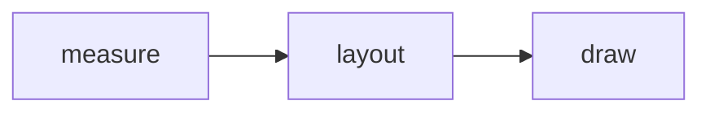
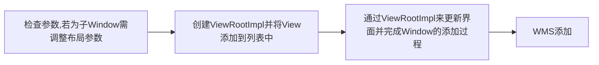

## Android 开发艺术探索 读书笔记

### Ch1 Activity 的生命周期和启动模式


- onStart 表示 Activity 正在被启动，即将开始，这时 Activity 已经可见了，但是还没有出现在前台，还无法与用户交互。可理解为 Activity 已经显示出来了，但是我们还没看到。
- onPause 表示 Activity 正在停止，正常情况下，紧接着 onStop 就会被调用。在特殊情况下，如果这个时候快速地再回到当前 Activity，那么 onResume 会被调用，注意不要在此进行耗时操作，避免影响到新 Activity 的展示。**onPause 必须先执行完，新 Activity 的 onResume 才会执行**。
- onStop 表示 Activity 即将停止，可以做一些稍微重量级的回收工作，但同样不能太过耗时。
- 当用户打开新的 Activity 或切换到桌面的时候，当前 Activity 的生命周期变化：`onPause`->`onStop`。特殊情况，**如果新 Activity 采用了透明主题，那么当前 Activity 不会回调`onStop`**。 
- 从整个生命周期来看，`onCreate`和`onDestroy`是配对的，分别标识着 Activity 的创建和销毁，并且只可能有一次调用。`onStart`和`onStop`是从 Activity 是否可见这个角度来回调的，而`onResume`和`onPause`是从 Activity 是否位于前台这个角度来回调的（除了这种区别，后续这两对生命周期没有其他明显区别）。
- 由 Android 源码可知，在新 Activity 启动之前，**栈顶的 Activity 需要先`onPause`之后，新 Activity 才能启动。**


异常情况下终止调用`onSaveInstanceState`保存当前 Activity 的状态的时机是在`onStop`之前，和`onPause`没有既定的时序关系；而恢复 Activity 状态的`onRestoreInstanceState`的调用时机是在`onStart`之后。重建时，系统是会将都会回调`onCreate`及`onRestoreInstanceState`，可在对应生命周期进行页面状态的恢复。

LaunchMode：standard、singleTop、singleTask、singleInstance（此模式下的 Activity 只能单独地位于一个任务栈之中）。`onNewInent`

TaskAffinity：任务相关性，标识了一个 Activity 所需的任务栈的名字。主要和 singleTask 启动模式或者 allowTaskReparenting 属性配对使用，在启动情况下没有意义。

> 当一个应用 A 启动了应用 B 的某个 Activity 后，如果这个 Activity 的`allowTaskReparenting`属性为 true 时，那么当应用 B 被启动后，此 Activity 会直接从应用 A 的任务栈转移到应用 B 的任务栈。

`intent.addFlags(Intent.FLAG_ACTIVITY_NEW_TASK)`设定启动模式的优先级要高于配置文件中设置的。

Activity 的 Flags：FLAG_ACTIVITY_NEW_TASK（singleTask）、FLAG_ACTIVITY_SINGLE_TOP（singleTop）、FLAG_ACTIVITY_CLEAR_TOP、FLAG_ACTIVITY_EXCLUDE_FROM_RECENTS（`android:excludeFromRecents="true"`）

IntentFilter 的匹配规则：只有一个 Intent 同时匹配 action 类别、category 类别、data 类别才算完全匹配，只有完全匹配才能成功启动目标 Activity；可有多个 intent-filter，有一组匹配成功即可。

Activity State and Fragment Callbacks relations:


Lifecycle 原理：底层内部是根据 Activity 生命周期状态反射对应的方法，这样就完成了整个流程，如下图。


### Ch2 IPC 机制

可先查看 [IPC 机制](https://github.com/huanggenghg/huanggenghg/blob/main/IPC%20%E6%9C%BA%E5%88%B6.md)

开启多进程：给四大组件指定`android:process`属性

多进程会造成的问题：静态成员和单例模式完全失效；线程同步机制完全失效；SharedPreference 的可靠性下降；Application 会多次创建......


Android 中的 IPC 方式：Intent 中附加 extras 传递信息，共享文件共享数据、Binder ContentProvider、网络通信、Socket 等。

- 使用 Bundle

- 使用文件共享

- 使用 Messenger

- 使用 AIDL

  > AIDL 文件支持的数据类型：基本数据类型（int、long、char、boolean、double 等）、String 和 CharSequence、List（只支持 ArrayList）、Map（只支持 HashMap）、Parcelable、AIDL。

- 使用 ContentProvider 

Binder 连接池：将每个业务模块的 Binder 请求统一转发到远程 Service 中去执行。

IPC 方式的优缺点和适用场景：

| 名称            | 优点                                                         | 缺点                                                         | 适用场景                                                     |
| --------------- | ------------------------------------------------------------ | ------------------------------------------------------------ | ------------------------------------------------------------ |
| Bundle          | 简单易用                                                     | 只能传输 Bundle 支持的数据类型                               | 四大组件的进程间通信                                         |
| 文件共享        | 简单易用                                                     | 不适合高并发场景，并且无法做到进程间的即时通信               | 无并发访问情形，交换简单的数据实时性不高的场景               |
| AIDL            | 功能强大，支持一对多并发通信，支持实时通信                   | 使用稍微复杂，需要处理好线程同步                             | 一对多通信且有 RPC 需求                                      |
| Messenger       | 功能一般，支持一对多串行通信，支持实时通信                   | 不能很好处理高并发情形，不支持 RPC，数据通过 Message 进行传输，因此只能传输 Bundle 支持的数据类型 | 低并发的一对多即时通信，无 RPC 需求，或者无须要返回结果的 RPC 需求 |
| ContentProvider | 在数据源访问方面功能强大，支持一对多并发数据共享，可通过 Call 方法扩展其他操作 | 可以理解为受约束的 AIDL，主要提供数据源的 CRUD 操作          | 一对多的进程间的数据共享                                     |
| Socket          | 功能强大，可以通过网络传输字节流，支持一对多并发实时通信     | 实现细节稍微有点繁琐，不支持直接 RPC                         | 网络数据交换                                                 |

### Ch3 View 的事件体系


After Android 3.0：
x，y：View 左上角的坐标
`x = left + translationX`、`y = top + translationY`
需要注意的是，View 在平移的过程中，top 和 left 表示的是原始左上角的位置信息，其值并不会发生改变，此时发生改变的是 x、y、translationX 和 translationY 这四个参数。

MotionEvent：ACTION_DOWN、ACTOION_MOVE、ACTION_UP

TouchSlop：滑动的最小距离

VelocityTracker：追踪手指当前的滑动速度
GestureDetector：检测用户的单击、滑动、长按、双击等行为
Scoller：用于实现 View 的弹性滑动

View 的滑动：使用`scrollTo`（绝对滑动）\`scrollBy`（相对滑动）、使用动画、改变布局参数

View 的事件分发机制：

```java
public boolean dispatchTouchEvent(MotionEvent ev) {
    boolean consume = false;
    if (onInterceptTouchEvent(ev)) {
        consume = onTouchEvent(ev);
    } else {
        consume = child.dispatchTouchEvent(ev);
    }
    
    return consume;
}
```


一个事件传递过程：Activity -> Window -> View，`onTouchEvent` retrun true means event handled in current view, or false for throw back the event to the parent view or window to consume the event.

- 事件序列：down -> move... -> up
- 一个事件序列一般只能被一个 View 拦截且消耗。特殊手段可以做到给其他 View，可通过`onTouchEvent`强行传递给其他 View 处理
- 某个 View 一旦决定拦截，那么这一个事件序列都只能由它来处理，并且它的`onInterceptTouchEvent`不会再被调用
- 某个 View 一旦开始处理事件，如果它不消耗 ACTION_DOWN 事件，那么同一事件序列中的其他事件都不会交给它来处理，会重新交由它的父元素去处理，即父元素的`onTouchEvent`会被调用
- 如果 View 不消耗除 ACTION_DOWN 以外的事件，那么这个点击事件会消失，此时父元素的`onTouchEvent`并不会被调用，并且当前 View 可以持续收到后续的事件，最终这些消失的点击事件会传递给 Activity 处理。
- 事件传递的过程是由外向内的，即事件总是先传递给父元素，然后再由父元素分发给子 View，通过`requestDisallowInterceptTouchEvent`方法可以在子元素中干预父元素的事件分发过程，但是 ACTION_DOWN 事件除外

- ViewGroup 默认不拦截任何事件。Android 源码中 ViewGroup 的`onInterceptTouchEvent`默认返回 false；View 没有`onInterceptTouchEvent`方法，一旦有点击事件传递给它，它的`onTouchEvent`方法就会被调用。


```java
// 顶级 View 对点击事件的分发过程
final boolean intercepted;
if (actionMasked == MotionEvent.ACTION_DOWN 
    || mFirstTouchTarget != null /* 单链表结构；不拦截由子元素处理事件，会赋值于子元素 */) {
    final boolean disallowIntercept = (mGroupFlags & FLAG_DISALLOW_INTERCEPT) != 0;
    if(!disaalowIntercept) {
        intercepted = onInterceptTouchEvent(ev);
        ev.setAction(action);
    }
} else {
    intercepted = true;
}
```

判断子元素是否能够收到点击事件：**子元素是否在播放动画和点击事件的坐标是否落在子元素的区域内**。

滑动冲突问题解决：

1. 外部拦截法：父容器处理
2. 内部拦截法：子元素处理，指定父容器是否拦截

### ch4 View 的工作原理

`performTraversals` three main role: 

- Measure views
- Layout views
- Draw views

NeasyreSpec（测量规格参数）

32 位 int 值，高 2 位代表 SpecMode，低 30 位代表 SpecSize。

- UNSPECIFIED：父容器不对 View 有任何限制，用于系统内部，表示一种测量状态
- EXACTLY：父容器已经检测出 View 所需要的精确大小，这个时候 View 的最终大小就是 SpecSize 所指定的值。对应 LayoutParams 中的 match_parent 和具体的数值这两种模式
- AT_MOST：父容器指定了一个可用大小 SpecSize，最大不能大于这个值，对应 LayoutParams 中的 wrap_content。



draw 过程：

1. 绘制背景
2. 绘制自己
3. 绘制 children
4. 绘制装饰

### ch7 Android 动画深入分析

动画种类：View 动画、帧动画和属性动画

属性动画：计算每帧动画所对应的属性的值，当下一帧到来时，PropertyValuesHolder 的`setAnimatedValue`会将新的属性值设置给对象。（get/set 方法都是通过反射来调用的）。

### ch8 理解 Window 和 WindowManager

Window 是一个抽象的概念，每一个 Window 都对应着一个 View 和 ViewRootImpl，Window 和 View 通过 ViewRootImpl 来建立联系。

```java
addView(View view, ViewGroup.LayoutParams params);
updateViewLayout(View view, ViewGroup.LayoutParams params);
removeView(View view); 
```

Window 的添加过程：



Window 的删除过程：


```java
boolean die(boolean immediate) {
    if (immediate && !mIsInTraversal) {
        doDie(); // 真正删除 View 的逻辑
        return false;
    }
    
    if (!mIsDrawing) {
        destroyHardwareRenderer();
    } else {
        ...
    }
    mHandler.sendEmptyMessage(MSG_DIE);
    return true;
}
```

`doDie()`->`dispatchDetachedFromWindow()`：

- 垃圾回收相关工作
- 通过 Session 的`remove`删除 Window：mWindowSession.remove(mWindow)，IPC 过程，最终会调用到 WMS 的`removeWindoow`
- 调用 View 的`dispatchDetachedFromWindow()`，内部会调用 View 的`onDetachedFromWindow()`以及`onDetachedFromWindowInternal()`
- 调用 WindowManagerGlobal 的`doRemoveView()`刷新数据，包括 mRoots、mParams 以及 mDyingViews，需要将当前 Window 所关联的这三类对象从列表删除。

Window 的更新过程：更新布局参数，重新布局，通过 WindowSession 更新 Window 的视图。

Window 的创建过程：

启动 Activity 会创建其所属的 Window 对象并设置回调接口。Window 对象的创建时通过 PolicyManager 的`makeNewWindow()`实现。

```java
public Window makeNewWindow(Context context) {
    return new PhoneWindow();
}
```

1. 如果没有 DecorView，就创建它
2. 将 View 添加到 DevorView 的 mContentParent 中
3. 回调 Activity 的 onContentChanged 方法通知 Activity 视图已经发生改变

Dialog 的 Window 的创建过程：

1. 创建 Window，同样是通过 PolicyManager 的`makeNewWindow`来完成，最后创建的对象实际上就是 PhoneWindow
2. 初始化 DecorView 并将 DIalog 的视图添加到 DecorView 中
3. 将 DecorView 添加到 Window 中并显示

> 普通的 Dialog 必须采用 Activity 的 Context，如果采用 Application 的 Context，那么就会报错（没有应用 token 所导致的）。

Toast 的 Window 的创建过程：


Toast 的显示和影响过程实际上是通过 Toast 中的 TN 这个类实现的。

```java
// TN handleShow
mWM = (WindowManager) context.getSystemService(Context.WINDOW_SERVICE);
mWM.addView(mView, mParams);
    
// NT handleHide
if (mView.getParent() != null) {
    mWM.remove(mView);
}
```

### ch9 四大组件的工作过程

Activity 展示型组件、Service 计算型组件、BroadcastReceiver 消息型组件、ContentProvider 数据共享型组件。

Activity 的工作过程：


Service 的工作过程：


BroadcastReceiver 的工作过程：

广播的注册分为静态注册和动态注册，其中静态注册的广博在应用安装时由系统自动完成注册，具体是由 PMS（PackageManagerService）来完成整个注册过程的，四大组件也都是在应用安装时由 PMS 解析并注册的。

广播的注册过程：


广播的发送和接收过程：

> FLAG_INCLUDE_STOPPED_PACKAGES：广播会发送给已停止的应用
> FLAG_EXCLUDE_STOPPED_PACKAGES：Since Android 3.1


创建 Args 对象并通过 mActivityThread 的`post`方法执行其 Runnable

```java
finnal BroadcastReceiver receiver = mReceiver;
receiver.setPendingResult(this);
receiver.onReceive(mContext, intent);
```

ContentProvider 的工作过程：


需要注意的是，ActivityThread 会先加载 ContentProvider，然后再调用 Application 的`onCreate`方法。

`android:multiprocess`为 false，ContentProvider 为单实例，否为多实例。

访问 ContentProvider 需要通过 ContentResolver。当 ContentProvider 所在的进程未启动时，第一次访问会触发 ContentProvider 的创建，当然这也伴随着 ContentProvider 所在进程的启动。

ApplicationContentResolver 的`acquireProvider`的具体实现：


### ch10 Android 的消息机制


MessageQueue：单链表
Looper：ThreadLocal

ThreadLocal：操作的对象都是当前线程的 localValues 对象的 table 数组，因此在不同线程中访问同一个 ThreadLocal 的 set 和 get 方法，它们对 ThreadLocal 所做的读写仅限于各自线程的内部。

MessageQueue：
`enqueueMessage`就是单链表的插入操作。`next`无限循环读取消息，若无消息会一直阻塞在这里。`nativePollOnce`。

Looper 的工作原理：Looper 扮演着消息循环的角色。`Looper.prepare()`为当前线程创建一个 Looper，接着通过`Looper.loop()`开启消息循环。（死循环，唯一跳出循环的方式是 MessageQueue 的`next`返回 null）。Looper 处理获取到的消息：`msg.target.dispatchMessage(msg)`，这里的`msg.target`就是发送这条消息的 Handler 对象。


ActivityThread 通过 ApplicationThread 和 AMS 进行进程间通信，AMS 以进程间通信方式完成 ActivityThread 的请求后会回调 ApplicationThread 中的 Binder 方法，然后 ApplicationThread 会向 H 发送消息，H 收到消息后会将 ApplicationThread 中的逻辑切换到 ActivityThread 中去执行，即切换到主线程中去执行，这个过程就是主线程的消息循环模型。

### ch11 Android 的线程和线程池

多线程方式：

- Thread
- AsyncTask：封装了线程池和 Handler，方便子线程更新 UI。Android 1.6 之前，串行执行任务；Android 1.6 时开始采用线程池处理并行任务；Android 3.0 开始，为了避免并发错误，又采用了一个线程来串行执行任务。并可通过`executeOnExecutor`来并行地执行任务
- HandlerThead：具有消息循环的线程，内部可使用 Handler
- IntentService：内部采用 HandlerThread 执行任务，执行完毕后会自动退出，方便执行后台任务

Android 中的线程池：

线程池的优点：减少性能开销、控制线程池最大并发数、对线程进行简单管理

```java
public ThreadPoolExecutor(int corePoolSize, // 核心线程数，核心线程池中会一直存活
                          int maximumPoolSize, // 能容纳的最大线程数，超过后续任务会被阻塞
                          long keepAliveTime, // 非核心线程闲置时的超时时长
                          TimeUnit unit,
                          BlockingQueue<Runnable> workQueue, // 线程池的任务队列
                          ThreadFactory threadFactory // 线程工厂，创建新线程
                         )
```

线程池执行任务规则：

1. 线程数量未达核心线程数量，直接启动一个核心线程来执行任务
2. 已达或超过核心线程的数量，任务会被插入到任务队列中排队等待执行
3. 若任务队列已满，并未达线程池最大数量值，会启动一个非核心线程来执行任务
4. 若已达线程池规定的最大值，会拒绝执行任务。会调用 RejectedExecutionHandler 的`rejectedExecution`来通知调用者。拒绝策略：CallerRunsPolicy、AbortPolicy（默认，会直接抛出 RejectedExecutionException）、DiscardPolicy 和 DiscardOldestPolicy。

线程池的分类：

1. FixedThreadPool：线程固定数量的线程池，只有核心线程并且这些核心线程没有超时机制
2. CachedThreadPool：线程数量不定的线程池，只有非核心线程，最大线程数为 Integer.MAX_VALUE，超时时长 60s
3. ScheduledThreadPool：核心线程数固定，非核心线程数没有限制，非核心线程闲置时会被立即回收。主要用于执行定时任务和具有固定周期的重复任务
4. SingleThreadExecutor：只有一个核心线程，单线程线程池。